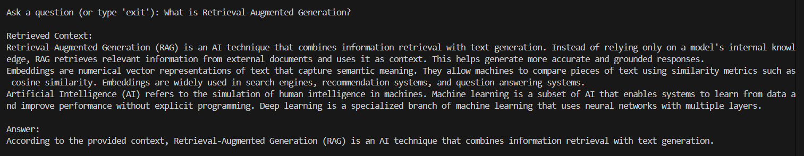
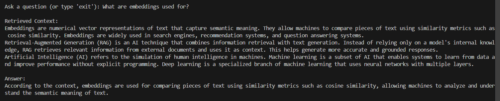
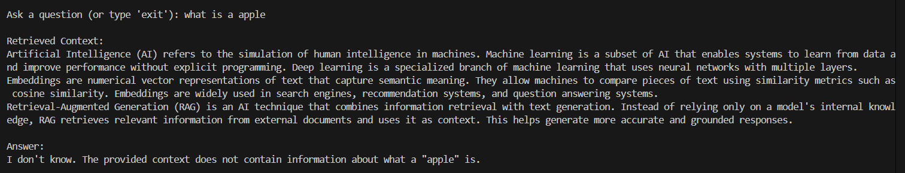

# Retrieval-Augmented Generation (RAG) System

A lightweight **Retrieval-Augmented Generation (RAG)** pipeline that answers questions using external documents through **semantic search and a local LLM**.

This project demonstrates the core architecture behind modern **AI document QA systems**.

---

## Demo

**Question 1**



**Question 2**



**Question 3** (out of context question)



---

## Key Features

- Document ingestion from text files
- Text chunking with overlap for better context retention
- Semantic embeddings using SentenceTransformers
- Vector similarity search with FAISS
- Context retrieval using Top-K nearest neighbors
- Answer generation using a local LLM (Ollama)

---

## Tech Stack

- **Python**
- **SentenceTransformers** – text embeddings
- **FAISS** – vector similarity search
- **NumPy** – vector operations
- **Ollama** – local LLM inference

---

## System Architecture
```
Documents
↓
Text Chunking
↓
Embedding Generation
↓
FAISS Vector Index
↓
User Query → Query Embedding
↓
Top-K Semantic Retrieval
↓
Context + Prompt
↓
LLM Answer
```
## How It Works

1. Load documents from a local data directory.
2. Split documents into overlapping text chunks.
3. Convert chunks into dense embeddings.
4. Store embeddings in a **FAISS vector index**.
5. Convert the user query into an embedding.
6. Retrieve the **top-K most similar chunks**.
7. Provide retrieved context to the LLM to generate an answer.

## Design Choices

**Chunking Strategy (100 words, 20 overlap)**  
Documents are split into smaller chunks to improve retrieval precision and stay within embedding model context limits. A small overlap (20 words) preserves context across chunk boundaries so important information is not lost.

**Embedding Model – SentenceTransformers (`all-MiniLM-L6-v2`)**  
This lightweight model generates high-quality 384-dimensional semantic embeddings while remaining fast and efficient for local inference. It is widely used for semantic search and retrieval tasks.

**Vector Search – FAISS (`IndexFlatL2`)**  
FAISS is used for efficient similarity search over embedding vectors. The `IndexFlatL2` index performs exact nearest-neighbor search and is suitable for small to medium datasets while keeping implementation simple.

**Cosine Similarity via L2 Normalization**  
Embeddings are L2-normalized before indexing. This makes L2 distance equivalent to cosine similarity, which is commonly used for semantic similarity between text embeddings.

**Top-K Retrieval (`k=3`)**  
Retrieving the top 3 most similar chunks balances context coverage and noise reduction, providing enough information for the LLM without overwhelming the prompt.

**Local LLM (Ollama – Llama 3)**  
Using a local LLM ensures privacy, eliminates API costs, and allows the system to run entirely offline while still generating coherent answers from retrieved context.

**Prompt Design**  
The prompt explicitly instructs the model to answer only using the provided context and to respond with "I don't know" when the answer is not present. This helps reduce hallucinations and keeps responses grounded in retrieved documents.